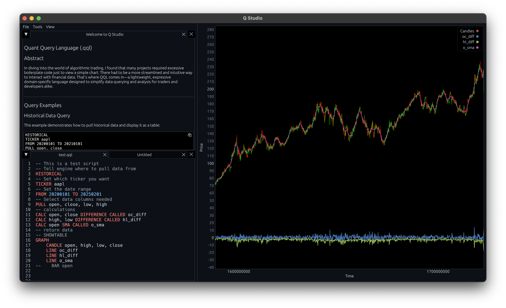

# Q Studio

**Q Studio** is an open-source visual platform for developing, testing, and running trading strategies using a custom domain-specific language called **Quant Query Language (.qql)**. It is designed for researchers, traders, and developers who want a programmable yet intuitive environment for financial data analysis and algorithmic trading.

---



## Overview

Q Studio is composed of two main components:

- **Q Studio (GUI):** A graphical interface for editing `.qql` files, running strategies, visualizing data, and managing outputs.
- **Engine:** The core interpreter and runtime responsible for lexing, parsing, and executing Quant Query Language queries.

Together, these tools create a highly modular, scriptable trading lab with fast iteration cycles, strong syntax tooling, and customizable analytics pipelines.

---

## Quant Query Language (.qql)

Quant Query Language (QQL) is a declarative scripting language tailored for financial workflows. It allows users to:
- Pull historical or live market data
- Perform technical and statistical calculations
- Generate tabular and graphical outputs
- Chain complex transformations and modeling steps

A detailed language reference is provided in [`qql.md`](./qql.md).

Example:

```qql
HISTORICAL
TICKER AAPL
FROM 20220101 TO 20230101
PULL open, close
CALC open, close DIFFERENCE CALLED oc_diff
SHOW

